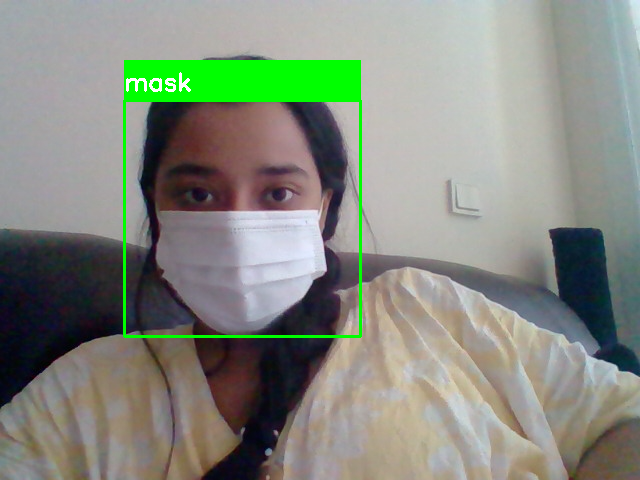

# 😷 Face Mask Detection using Convolutional Neural Networks
This project implements a real-time face mask detection system using TensorFlow and OpenCV. It loads a model (`final_model.keras`) to classify whether a person is wearing a mask or not using webcam input.

---


## 🛠️ Tech Stack

- Python 3.x
- TensorFlow / Keras
- OpenCV
- NumPy

---

## 🧠 Model Details

- Input size: `150x150` RGB images
- Output Labels: Binary classification → `Mask` / `No Mask`
- Trained using: [DataFlair Face Mask Detection Dataset](https://data-flair.training/blogs/face-mask-detection-dataset/)
- Saved model: `final_model.keras`

---

## ▶️ How to Run

### If using the pre-trained model in the repo:

### 1. Clone the repository
```bash
git clone https://github.com/AiswaryaShajan/face_mask_detection.git
cd face_mask_detection
```  

### 2. Install Dependencies
```bash
pip3 install opencv-python tensorflow numpy
``` 
### 3. Run the Detector
```bash
python3 .\face_mask_model.py
```
`Press Q to exit the webcam window.`

### 🖼️ Demo Screenshot


### If training the model from scratch:

### 1. Download the dataset here: https://data-flair.training/blogs/download-face-mask-data/

### 2. Using a jupyter notebook or google colab make a python file train.py to write the code for training the neural network on our dataset. Follow the steps:

### 3. Import libraries
```bash
from keras.optimizers import RMSprop
from keras.preprocessing.image import ImageDataGenerator
import cv2
from keras.models import Sequential
from keras.layers import Conv2D, Input, ZeroPadding2D, BatchNormalization, Activation, MaxPooling2D, Flatten, Dense,Dropout
from keras.models import Model, load_model
from keras.callbacks import TensorBoard, ModelCheckpoint
from sklearn.model_selection import train_test_split
from sklearn.metrics import f1_score
from sklearn.utils import shuffle
import imutils
import numpy as np
```
### 4. Build the network
```bash
model = Sequential([
    Conv2D(100, (3,3), activation='relu', input_shape=(150, 150, 3)),
    MaxPooling2D(2,2),
    
    Conv2D(100, (3,3), activation='relu'),
    MaxPooling2D(2,2),
    
    Flatten(),
    Dropout(0.5),
    Dense(50, activation='relu'),
    Dense(2, activation='softmax')
])
model.compile(optimizer='adam', loss='binary_crossentropy', metrics=['acc'])
```
### 5. Augmentation
```bash
TRAINING_DIR = "./train"
train_datagen = ImageDataGenerator(rescale=1.0/255,
                                   rotation_range=40,
                                   width_shift_range=0.2,
                                   height_shift_range=0.2,
                                   shear_range=0.2,
                                   zoom_range=0.2,
                                   horizontal_flip=True,
                                   fill_mode='nearest')

train_generator = train_datagen.flow_from_directory(TRAINING_DIR, 
                                                    batch_size=10, 
                                                    target_size=(150, 150))
VALIDATION_DIR = "./test"
validation_datagen = ImageDataGenerator(rescale=1.0/255)

validation_generator = validation_datagen.flow_from_directory(VALIDATION_DIR, 
                                                         batch_size=10, 
                                                         target_size=(150, 150))
```
### 6. Set up a checkpoint callback to save the best-performing model after each training epoch.
```bash
checkpoint = ModelCheckpoint('model2-{epoch:03d}.model',monitor='val_loss',verbose=0,save_best_only=True,mode='auto')
```

### 7 Train the model:
```bash 
history = model.fit_generator(train_generator,
                              epochs=10,
                              validation_data=validation_generator,
                              callbacks=[checkpoint])
```

### 8. Make a script called test.py and copy the following:
```bash 
import cv2
import numpy as np
from keras.models import load_model
model=load_model("./model-010.h5")

results={0:'without mask',1:'mask'}
GR_dict={0:(0,0,255),1:(0,255,0)}

rect_size = 4
cap = cv2.VideoCapture(0) 


haarcascade = cv2.CascadeClassifier('/home/user_name/.local/lib/python3.6/site-packages/cv2/data/haarcascade_frontalface_default.xml')

while True:
    (rval, im) = cap.read()
    im=cv2.flip(im,1,1) 

    
    rerect_size = cv2.resize(im, (im.shape[1] // rect_size, im.shape[0] // rect_size))
    faces = haarcascade.detectMultiScale(rerect_size)
    for f in faces:
        (x, y, w, h) = [v * rect_size for v in f] 
        
        face_img = im[y:y+h, x:x+w]
        rerect_sized=cv2.resize(face_img,(150,150))
        normalized=rerect_sized/255.0
        reshaped=np.reshape(normalized,(1,150,150,3))
        reshaped = np.vstack([reshaped])
        result=model.predict(reshaped)

        
        label=np.argmax(result,axis=1)[0]
      
        cv2.rectangle(im,(x,y),(x+w,y+h),GR_dict[label],2)
        cv2.rectangle(im,(x,y-40),(x+w,y),GR_dict[label],-1)
        cv2.putText(im, results[label], (x, y-10),cv2.FONT_HERSHEY_SIMPLEX,0.8,(255,255,255),2)

    cv2.imshow('LIVE',   im)
    key = cv2.waitKey(10)
    
    if key == 27: 
        break

cap.release()

cv2.destroyAllWindows()
```
### 9. Run the script to test model performance. 
```bash 
    python3 test.py
```

